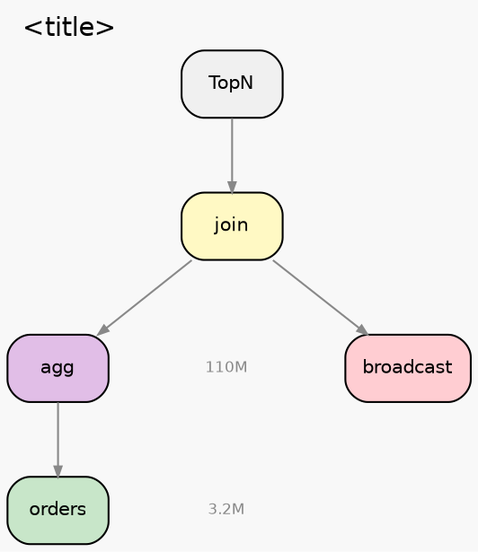
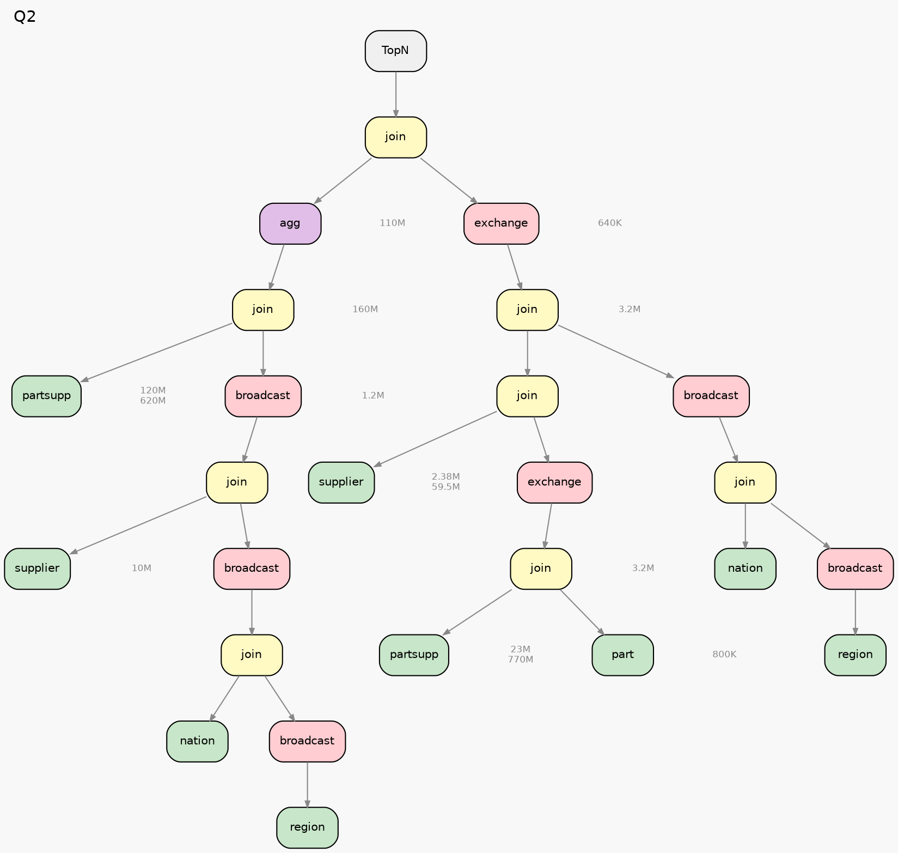

# Plan Visualization — Graphviz Reference

**Do not draw by default** — only execute when the user explicitly requests it.

---

## Workflow

1. Parse operator nodes and parent-child relationships from EXPLAIN output
2. Generate DOT code following the color specification
3. Render: `dot -Tpng <file>.dot -o <file>.png -Gdpi=150`

---

## Color Specification

| Category | fillcolor | Operators |
|----------|-----------|-----------|
| Sort | `#F0F0F0` | TopN, MemSort, MergeSort, Limit |
| Join | `#FFF9C4` | HashJoin, NLJoin, BKAJoin, SortMergeJoin, SemiHashJoin |
| Agg | `#E1BEE7` | HashAgg, SortAgg, PartialHashAgg |
| Exchange | `#FFCDD2` | Exchange, Gather, broadcast |
| TableScan | `#C8E6C9` | LogicalView, IndexScan, OSSTableScan |
| Filter/Project | `#E3F2FD` | Filter, Project |
| Window | `#FFF3E0` | Window, HashWindow, SortWindow |
| CTE | `#F3E5F5` | CTEAnchor, CTEProducer, CTEConsumer |
| SetOp | `#E0F7FA` | UnionAll, UnionDistinct |
| Other | `#FAFAFA` | Expand, Values, RuntimeFilterBuilder |

---

## Node Label Rules

- **Operator nodes**: Join/Agg/Sort etc. display operator type (e.g., `join`, `agg`, `TopN`)
- **TableScan nodes**: Display table name (e.g., `orders`, `lineitem`)
- **Exchange nodes**: Display distribution type (e.g., `broadcast`, `exchange`)
- **Row count annotations**: Independent plaintext nodes placed beside the operator
  - >= 100M: `XM` (e.g., `120M`)
  - >= 10K: `XK` (e.g., `3.2M`)
  - < 10K: Raw value
- **Annotation positioning**: Use invisible edges + `{rank=same}` to align annotations beside operators

---

## DOT Template

---

## Full Example (TPC-H Q2)

